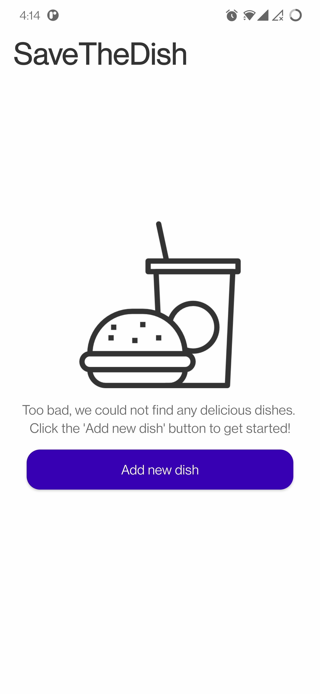

# SaveTheDish

SaveTheDish is a clean and minimalist Android app that allows users to view recipes that they can cook using the ingredients they have at home.

  
  
  
  
  
  

## Architecture

SaveTheDish features a simple single-activity architecture with plans of implementing fragments in the future to handle increased complexity.

  

## Database

An SQLite Database is used to store, read and edit dishes/recipes locally.

## User Interface

* The first CardView provides an EditText for the user to input a comma-separated list of the ingredients they have.
* It also incorporates Buttons to execute the Search and Add a new dish.
* _dishesYouCanCook_ RecyclerView displays the dishes the user can cook with their current ingredients.
* _allDishes_ RecyclerView shows all the dishes added by the user in the past along with Edit and Delete buttons.
